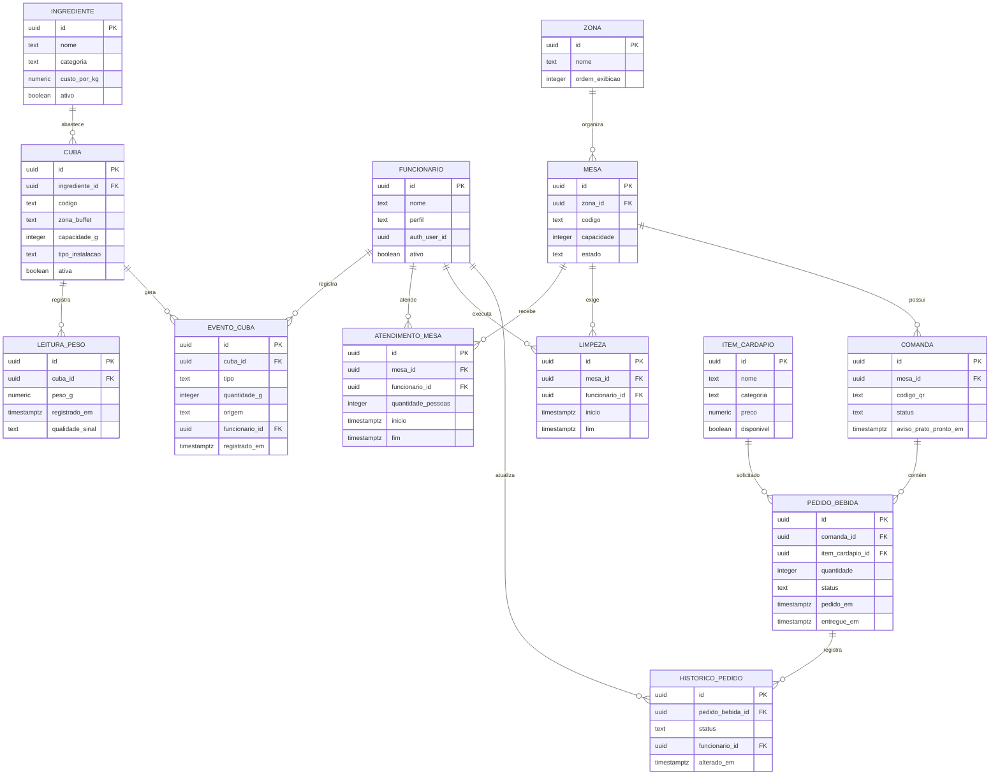

# Diagrama Entidade-Relacionamento

O diagrama abaixo representa as 13 tabelas do modelo PostgreSQL descrito na proposta.

```mermaid
erDiagram
  INGREDIENTE ||--o{ CUBA : abastece
  CUBA ||--o{ LEITURA_PESO : registra
  CUBA ||--o{ EVENTO_CUBA : gera
  FUNCIONARIO ||--o{ EVENTO_CUBA : registra
  ZONA ||--o{ MESA : organiza
  MESA ||--o{ ATENDIMENTO_MESA : recebe
  FUNCIONARIO ||--o{ ATENDIMENTO_MESA : atende
  MESA ||--o{ LIMPEZA : exige
  FUNCIONARIO ||--o{ LIMPEZA : executa
  MESA ||--o{ COMANDA : possui
  COMANDA ||--o{ PEDIDO_BEBIDA : contém
  ITEM_CARDAPIO ||--o{ PEDIDO_BEBIDA : solicitado
  PEDIDO_BEBIDA ||--o{ HISTORICO_PEDIDO : registra
  FUNCIONARIO ||--o{ HISTORICO_PEDIDO : atualiza

  INGREDIENTE {
    uuid id PK
    text nome
    text categoria
    numeric custo_por_kg
    boolean ativo
  }
  CUBA {
    uuid id PK
    uuid ingrediente_id FK
    text codigo
    text zona_buffet
    integer capacidade_g
    text tipo_instalacao
    boolean ativa
  }
  LEITURA_PESO {
    uuid id PK
    uuid cuba_id FK
    numeric peso_g
    timestamptz registrado_em
    text qualidade_sinal
  }
  EVENTO_CUBA {
    uuid id PK
    uuid cuba_id FK
    text tipo
    integer quantidade_g
    text origem
    uuid funcionario_id FK
    timestamptz registrado_em
  }
  FUNCIONARIO {
    uuid id PK
    text nome
    text perfil
    uuid auth_user_id
    boolean ativo
  }
  ZONA {
    uuid id PK
    text nome
    integer ordem_exibicao
  }
  MESA {
    uuid id PK
    uuid zona_id FK
    text codigo
    integer capacidade
    text estado
  }
  ATENDIMENTO_MESA {
    uuid id PK
    uuid mesa_id FK
    uuid funcionario_id FK
    integer quantidade_pessoas
    timestamptz inicio
    timestamptz fim
  }
  LIMPEZA {
    uuid id PK
    uuid mesa_id FK
    uuid funcionario_id FK
    timestamptz inicio
    timestamptz fim
  }
  COMANDA {
    uuid id PK
    uuid mesa_id FK
    text codigo_qr
    text status
    timestamptz aviso_prato_pronto_em
  }
  ITEM_CARDAPIO {
    uuid id PK
    text nome
    text categoria
    numeric preco
    boolean disponivel
  }
  PEDIDO_BEBIDA {
    uuid id PK
    uuid comanda_id FK
    uuid item_cardapio_id FK
    integer quantidade
    text status
    timestamptz pedido_em
    timestamptz entregue_em
  }
  HISTORICO_PEDIDO {
    uuid id PK
    uuid pedido_bebida_id FK
    text status
    uuid funcionario_id FK
    timestamptz alterado_em
  }
```
